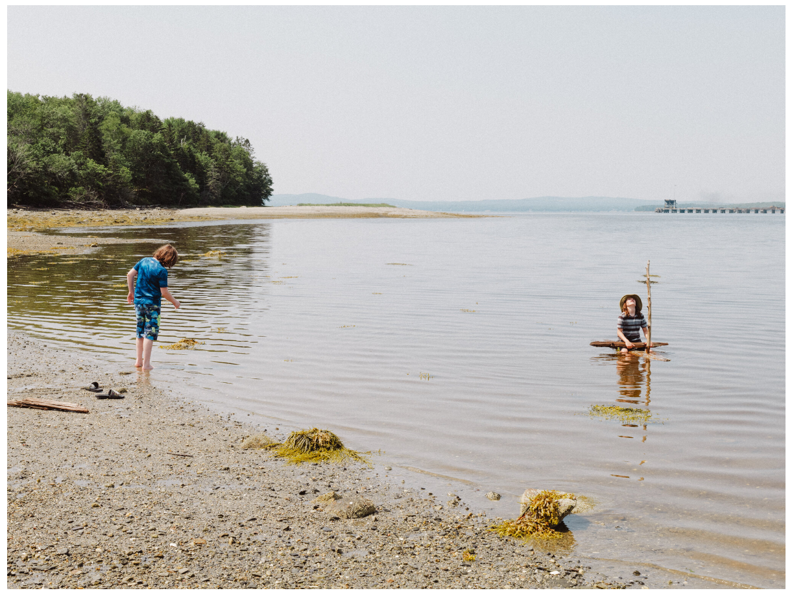
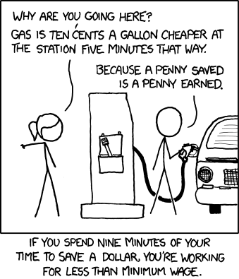
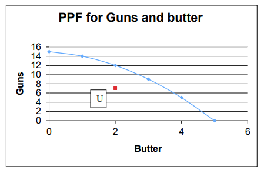

# Example Presentation

---

# Sears Island, Maine

---

# The Clean Energy Future

> One conservationist against the plan... predicted environmental groups would sue to thwart development of the island.... And that, as you can imagine, is going to run the clock," he said, **costing the state valuable time** that could be saved by looking elsewhere.
> -- The New York Times, August 16, 2023

---

# Opportunity Costs

The benefits that you would have gained from choosing the next-best alternative (i.e., *not* Sears Island):
- No costly environmental review
- No lawsuits
- **Years (?) of clean energy**

---

---

---

>	As every individual, therefore, endeavours as much as he can, both to employ his capital in the support of domestic industry, and so to direct that industry that its produce may be of the greatest value; every individual necessarily labours to render the annual revenue of the society as great as he can. He generally, indeed, neither intends to promote the public interest, nor knows how much he is promoting it. By preferring the support of domestic to that of foreign industry, he intends only his own security; and by directing that industry in such a manner as its produce may be of the greatest value, he intends only his own gain; and he is in this, as in many other cases, **led by an invisible hand to promote an end which was no part of his intention**. Nor is it always the worse for the society that it was no part of it. By pursuing his own interest, he frequently promotes that of the society more effectually than when he really intends to promote it.
	- The Wealth of Nations (IV.ii.9)

---

