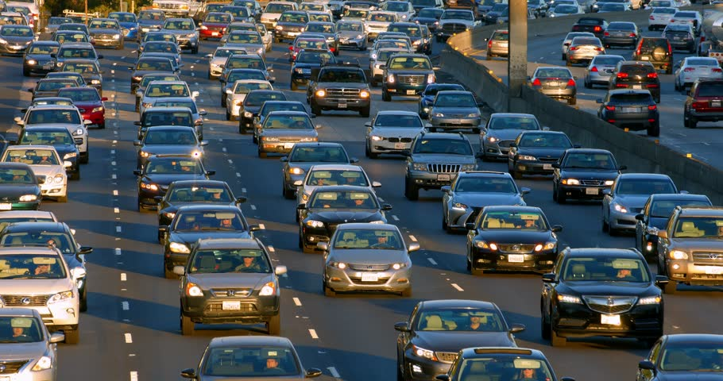
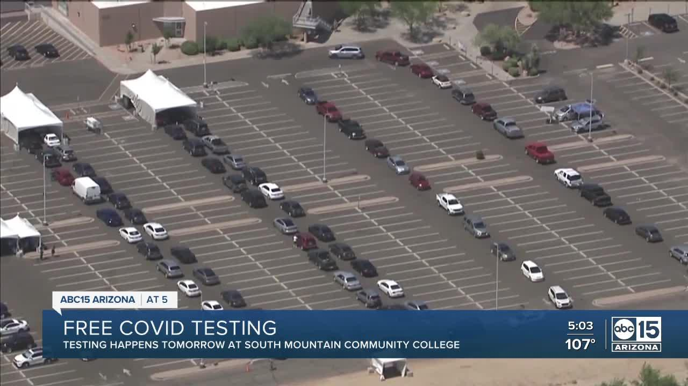
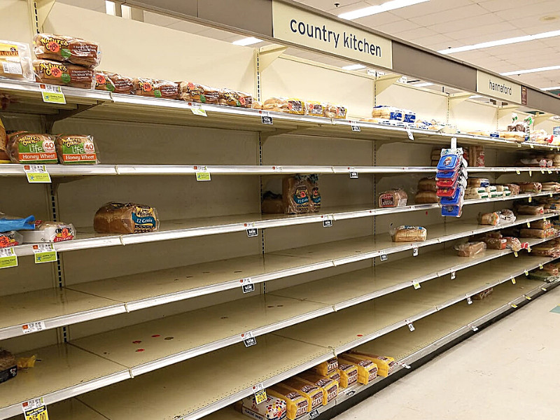
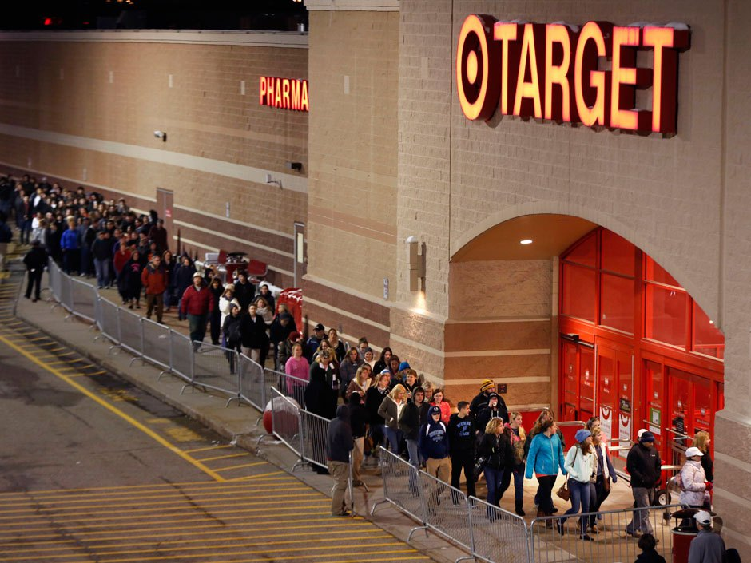
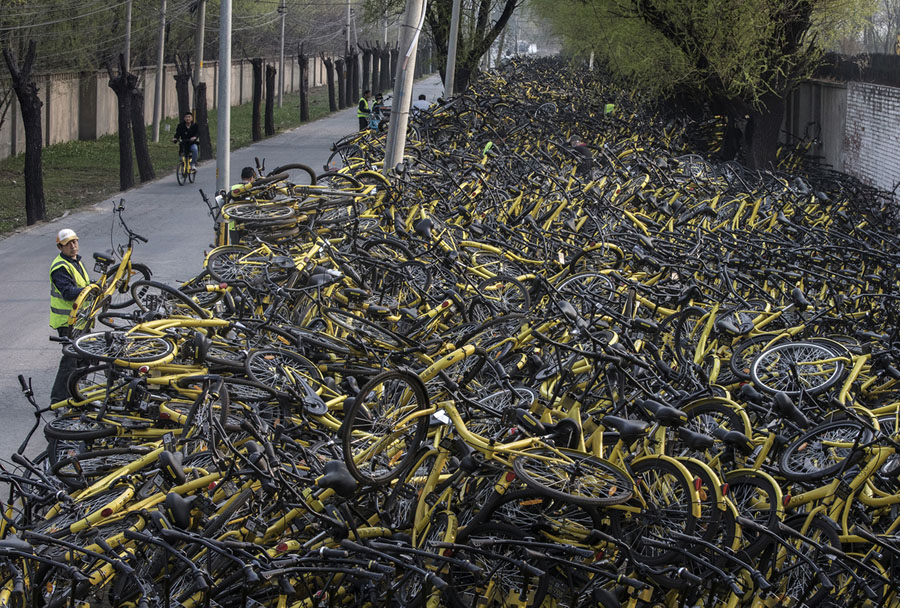

# Alfred Marshall

---

Alfred Marshall, *Principles of Economics* (1890):
> We might as reasonably dispute whether it is the upper or the under blade of a pair of scissors that cuts a piece of paper, as whether value is governed by utility or cost of production. It is true that when one blade is held still, and the cutting is effected by moving the other, we may say with careless brevity that the cutting is done by the second; but the statement is not strictly accurate, and is to be excused only so long as it claims to be merely a popular and not a strictly scientific account of what happens.

---

# Shortages & Surpluses
If prices **can't move freely** (e.g., rent control), then we may see **sustained** shortages or surpluses.

&nbsp;

Why are there temporary shortages and surpluses?

---

# Sustained

---

# Sustained

---

# Temporary

 ---

# Temporary

---

# Temporary

