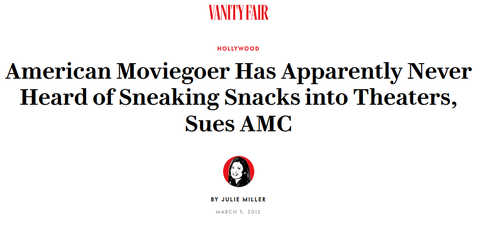
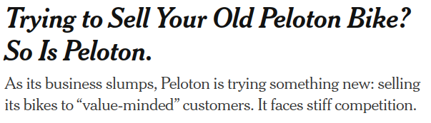

# Week 3

---

## Arbitrage
Prices should be roughly the same across markets

Markets are connected: goods can be traded across
- space (by shipment)
- time (by storage)

Consider two markets separated by time: the market for **potatoes** in **Fall** and **Winter**.

---

	
---
# Concurrent Shifts

When both supply and demand shift, we know how **either** price **or** quantity will change, but not both.

---
## Supply $\uparrow$, Demand $\downarrow$
*New York Times* (9/2/2022):

---

# Non-market allocations
Selective universities have a **persistent shortage** of spots

Instead of raising prices and enrolling only the wealthiest, they use a **non-market allocation** based on other criteria

Why?

---

# Non-market allocations
UVA has some of the same motivations as the Dave Matthews Band:
- **Network externalities**: value of UVA is proximity to smart people, not wealthy people.
- **Alumni donations**: pay less now, more later
- **Fairness**: no 18-year-old can afford tuition
- **Efficiency**: students who benefit most aren't necessarily able to pay the most
- **Prestige**: exclusivity as advertisement
