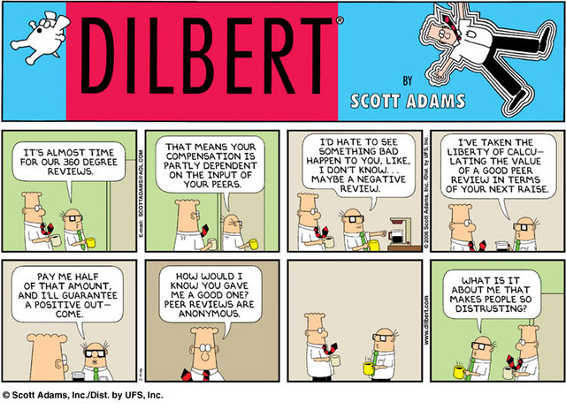
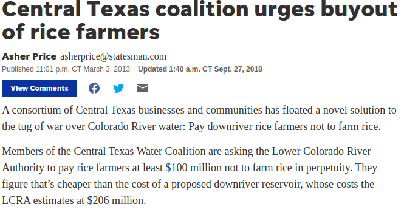
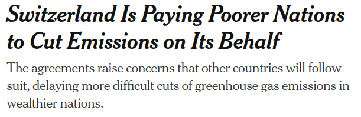

Firms that emit toxins into the air without paying pollution taxes or purchases licenses to pollute tend to 
- Underproduce because the private cost of production exceeds the social cost
- Overproduce because the social cost of production exceeds the private cost
- Produce the same quantity as nonpolluting firms
- Produce the socially optimal amount
- "Internalize the externality" in the product's price

---

In the economic analysis of negative externalities (e.g., toxins in the atmosphere)
- The optimal amount of the negative externality is \textbf{zero}
- One considers the costs of reducing the toxins, not the benefits; environmentalists considier the benefits and not the costs
- The private costs of an economic activity are \textbf{greater} than the social costs
- The optimal amount of the externality is determined where MSC is equal to MSB
- A proper application of corrective taxes will \textbf{reduce} the price that consumers pay for the externality-generating good.

---

# The Coase Theorem
- government can enforce **property rights**
- transaction costs are low
- agents have symmetric information and can make contracts

---

---

---

