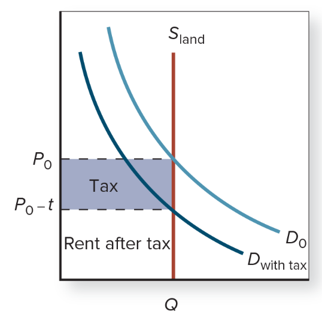
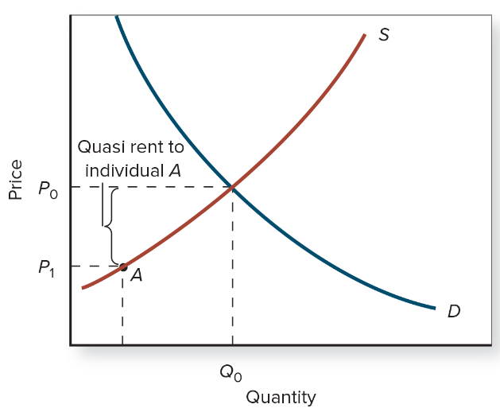
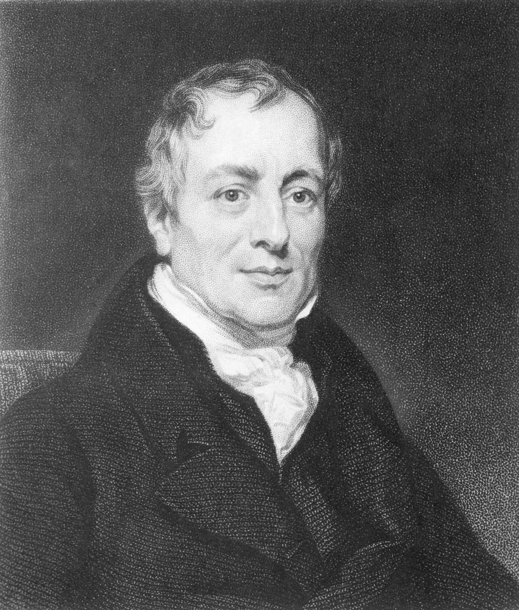

# Economic Rents

---

# Rent = Producer Surplus 

## Supply is *perfectly inelastic* (fixed): **rent**

## Supply is *elastic*: **quasi-rent**

---

## Rent:
income from a factor of production in **fixed supply**

&nbsp;
If supply is fixed, a tax falls **exclusively** on producers

---

## Quasi-rent:
payments to a resource above its opportunity cost

---

## Rent-seeking:
activities meant to **transfer surplus** from one group to another

---

# David Ricardo

Rent-seeking landowners use **restrictions on food imports** ("Corn Laws") to enrich themselves

---

## In the language of economics, rent is
1. the payment made to a landlord for the supply of housing
2. any revenue stream devoted to housing not made by a homeowner
3. a form of income which, if partially taxed, affects the supply of the input
4. one form of in-kind income for tenant farmers
5. income over and above what would be necessary to incentivize someone to do the job (or perform the task) he or she is being paid to do

---

## In the language of economics, rent is
1. the payment made to a landlord for the supply of housing
2. any revenue stream devoted to housing not made by a homeowner
3. a form of income which, if partially taxed, affects the supply of the input
4. one form of in-kind income for tenant farmers
5. **income over and above what would be necessary to incentivize someone to do the job (or perform the task) he or she is being paid to do**

---

## Consider two resource markets in which the demand curves slope downward. In market A, the supply curve is horizontal, equilibrium price is $6, and 100 units of the resource are hired. In market B, the supply curve is vertical, equilibrium price is $20, and 30 units of the resource are hired. Which of the following is true?
1. Total resource earnings are the same in both markets.
2. Total resource earnings are greater in market A.
3. Total resource earnings are greater in market B.
4. There is more economic rent in market A.
5. There is derived demand in market A, but not in market B.

---

## Consider two resource markets in which the demand curves slope downward. In market A, the supply curve is horizontal, equilibrium price is $6, and 100 units of the resource are hired. In market B, the supply curve is vertical, equilibrium price is $20, and 30 units of the resource are hired. Which of the following is true?
1. **Total resource earnings are the same in both markets.**
2. Total resource earnings are greater in market A.
3. Total resource earnings are greater in market B.
4. There is more economic rent in market A.
5. There is derived demand in market A, but not in market B.

---

## Producers have a greater incentive to engage in rent-seeking activities when demand is
1. inelastic
2. elastic

---

## Producers have a greater incentive to engage in rent-seeking activities when demand is
1. **inelastic**
2. elastic
